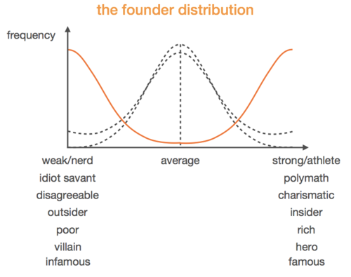
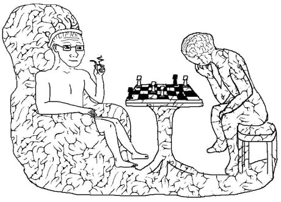
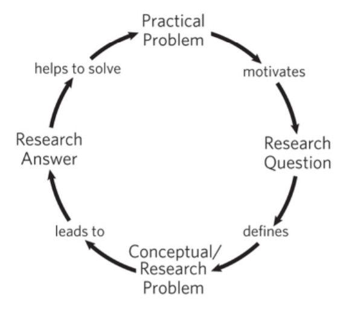
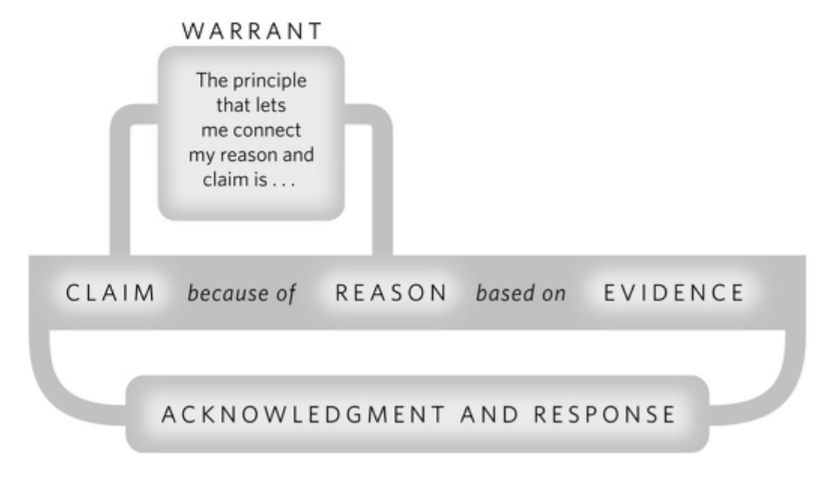

This post is to collect summaries and key takeaways from the books I read. All summaries range from mostly to totally positive.
This is because I only summarized books I've read in their entirety.
If I didn't like a book I would have stopped reading it.
I've kept track of every book since 2019, and often read a couple books at a time.

{:.no_toc}

* A markdown unordered list which will be replaced with the ToC, excluding the "Contents header" from above
{:toc}

# The Culture Code - Daniel Coyle

> Why do some groups come together and add up to be greater than the sum of its parts?

If I were to ask you who could do linear algebra better: a group of kinder-gardeners or a group of MBA students, you would likely pick the latter.
How about something simpler: build a tower with nothing but spaghetti, tape, string, and a marshmallow.
In this regard, the kinder-gardeners triumph.
Why?
This is the question that "The Culture Code" exists to answer.
Culture, no matter the type or scale, is essential to every choice, action, and thought one has.
This is because none is made without culture in mind, yet all of them ultimately influence culture itself.

## Key Takeaways

 - The psychological effects of just a handfull of words and the way those words are delivered is overwhelmingly powerful. To ask a stranger at the bus station on a rainy day "Can I borrow your phone?" versus "I'm so sorry about the rain, can I borrow your phone" is the difference between a 422% increase in response rate. 6 words = 4x as likely to get what you want. Unreal.
 - No one knows his name, but Jeff Dean made Google the giant that it is today. He is the reason why when you search Kawasaki H1B motorcycle on Google AdWords, you get the motorcycle and not a H-1B foreign visa application. Jeff did this, not because it was his job to, but because he was so in tune with what Google stood for, he took it upon himself to work on a problem that wasn't even his department. When confronted about his solution, he said "It didn't feel special or different. It was normal. That kind of thing happened all the time."
 - In the event of a catastrophic failure (the official term the National Transporation Safety Board used for United Airlines Flight 232) the words you use are a matter of life or death. Pilots use what is known as notifications; maximize information, vulnerability, and openness with as little words as possible. 
 - Tony Hsieh, the eccentric founder of LinkExchange (sold to Microsoft) and Zappos (sold to Amazon), has a unique take of building culture and making new friends; he is notorious for mediating warm introductions between new people he meets and people he already knows. Basically leveraging arguably the most valuable resource; human resources.
 - Pixar saved Disney from making any more animated movie atrocities. They did this with more than just creativity. Pixar's "Inside Out", "Nemo", and "Monster's Inc,", literally taught Disney how to make "Frozen", "Big Hero 6", and "Zootopia". When Disney acquired Pixar, they acquired more than just creativity; they acquired Pixar's community and culture of communication, bar-setting, and vulnerability.
 
 - The coaches of top basketball teams, high ranking officers of the Navy SEALs, and owners of some of the best restaurants in the world (11 Madison Park and Shake Shack) all have something in common. The pre and post. Each highly successful group has a different name for them, but simply put, what happens before and after a big game, a dangerous operation, or a busy Friday dinner service, is key to community growth.

# The Talent Code - Daniel Coyle
## Key Takeaways

# Zero to One - Peter Thiel

> How do you build an impactful, sustainable, profitable, and successful startup; how do you go from 0 to 1?

Peter Thiel is the "veteran of a hundred battles" of the startup world.
Best known for PayPall, Thiel started more than just a company; his story influenced the very culture, methods, and ideas that are central to startups.
Just look at the "PayPall Mafia", a group of individuals who, after leaving PayPall, went on to start more highly impactful companies, analogous to the way the splitting of an atom causes a domino effect.

Peter Thiel takes common misconceptions about startups and shreds them apart, whilst revealing the truth behind the secrets of any successful startup.
Drawing from both his own experiences and observations, he details everything from the economics to the operations, from the market to the team, and covers all corners.
It's like a cheatsheet for founders, entrepreneurs, and techies.

## Key Takeaways

 - For good companies are great - when done correctly. In the first decade of the 2000s, there was a boom in green-tech/ clean-tech startups. Almost all of them, save for Tesla and a handful of others, survived.
 - PayPal and X.com (an online banking company built by Elon Musk) put aside their competition to survive the dot-com crash; a move that saved them both in a crash that took down hundreds of companies.
 - There is a reason why most successful co-founders are shut-ins. The population can be represented by a normal distribution (black line)
{:class="img-responsive"}

this normal distribution is universal. What makes founders, entrepreneurs, and tech nerds so different? It turns out, they are exactly the opposite (orange line). They are polarizing to the point of irony. Name any notable founder and they belong in one of the extremes. 

# Brief Andwers to the Big Questions - Stephen Hawking
Is there a God? How did it all begin? Is there extraterrestrial intelligent life? Can we predict the future? What is inside a black hole? Is time travel possible? Will we survive on Earth? Should we colonize space? Will A.I outsmart us? How do we shape the future?

In honor of the late and forever great Stephen Hawking, BABQ was a book I had to read.
Hawking's final work focuses on the final 10 questions he was striving to answer.
I found myself gazing up at the sky more often this month than even before in my life, even as a child.
It fascinating to read about the history of the universe in a style reminiscent of  "Sapiens", only this time, from the perspective of a world renowned physicist.
This book made me realize how unfortunate it is that most people hear the voices of less intelligent people more often than the smartest people.
It made me think and realize that the smart people tend to be careful when making statements; they are experts at discerning fact from fiction or hypothesis.
One can then infer that we should be paying attention to any statements smart people say. Today, this fact cannot be understated.

This book, regardless of your background, beliefs, or knowledge, is a must read.
You will finish it feeling enlightened, inspired, and best of all, optimistic.
May he rest in piece, next to the ashes of Sir Isaac Newton and Charles Darwin.
He will be immortalized by his contributions and remembered as one among the pantheon of the smartest people in history, and, to match his scale of vision, the smartest creatures in the universe.

## Key Takeaways

 - Hawking subscribes to the Weak Anthropic Principle, that is, he takes the values of the physical constants as given. A principle that states that only in a universe capable of eventually supporting life will there be living beings capable of observing and reflecting on the matter.
 - The universe has 3 ingredients: matter, energy, and space. Einstein discovered (with E = mc²) that mass and energy are basically the same thing, hence there are only two ingredients: energy and space.
 - "Do we need a God to set it up so that the Big Band could bang?… It is possible that nothing caused the Big Bang… Time didn't exist before the Big Bang so there is no time for God to make the universe in"
 - Black holes exist because of a concept best described as analogous to escape velocity. That is to say that, like how a rocket must reach above 11 km/s to escape an object with earth-like mass, an object must reach more than 300k km/s (light speed) to escape a black hole.
 - "If you know how something works, you can control it" - Hawking, echoes the now famous "What I cannot create, I do not understand" - Fyenman. It seems as is if all the great scientists followed the same train of thought.
 - Building upon the takeaways of Yuval Noah Harari's "Sapiens" trilogy, the future of humanity relies on a handful of technologies and industries: Artificial intelligence, Biotechnology, Brain computer interfaces, Fusion energy (Hawking's response to "What would you like to see implemented), and Space exploration.
 - To end, Hawking leaves us with this: "We stand at a threshold of important discoveries in all areas of science… We will find out what happened at the Big Band. We will come to understand how life began on Earth… We will continue to explore our cosmic habitat… We must look outwards to the wider universe, while also striving to fix the problems on Earth… And one final point - we never really know where the next great scientific discovery will come from, nor who will make it.

# Architects of Intelligence - Martin Ford

I was window shopping in a book store one day when the title caught my eye.
After only having read the premise of the book, I followed my instinct and bought it right then and there.
"Architects of Intelligence" is the aggregation of various interviews conducted with the greatest minds in the field of Artificial Intelligence.
Martin Ford previously published "Rise of the Robots", an in depth look at the direction of the industry and how it will impact society business, and government.
The key takeaways here outnumber that of any other book I read this year.
I have no doubt this is partly due to my extensive research in the field, but also because Martin Ford does a tremendous job aggregating, filtering, and condensing all the juiciest tidbits of knowledge from some of the smartest people in the world.
The book almost radiates with value.

## Key Takeaways

 - Not any of the big names in A.I are vehemently against "A.I taking over our jobs". More specifically, the common agreement seems to be that technology as a whole will always continue to make life easier for humankind (when used correctly), and that the effect technology will inevitably have over jobs is a government and regulation issue, and the technology should not be "blamed"
 - China is, according to mainstream media and a significant portion of Americans, the monster under the bed come to life. When asked if China is a threat, especially with their breakthroughs and contributions in A.I, the interviewees all seemed to have a perspective from a technological and progressional point of view; progress in A.I is always good, what is bad is when A.I is used for things like automated weaponry or surveillance.
 - This one got me particularly hyped: we should be very suspicious of Back-propagation. According to Hinton himself, BP is considerably more efficient and effective than any preceding method, BUT research has shown that BP is not how humans "learn". Neural Networks, to be sure, are indeed the fundamental bricks of our brains, but Hinton and many others think that we should be on the look out for the next big step after BP. Here's Hinton himself doing a light criticism on the very algorithm he popularized:
 - This one will be obvious to the learned data scientist and machine learner: supervised learning is being used to overhype A.I as a field, and unfortunately it's not sustainable. Yann LeCun:
> "If intelligence is a cake, the bulk of the cake is unsupervised learning, the icing on the cake is supervised learning, and the cherry on the cake is reinforcement learning (RL)." - Yann LeCun

 - Interesting point about the history of Deep Learning; there was a time when the majority of researchers in A.I were bashing Deep Learning, thinking that the so called "symbolic A.I" methods of the time would prevail. LeCun, Hinton, and Bengio, and a handful of other leaders and followers persevered through the shit-storm and survived the A.I winter with groundbreaking results/victories/discoveries at around the 2010s
 - A common trend in the discussions about society's fascination with A.I points out that we really shouldn't be listening to people like Elon Musk and Stephen Hawking (both of whom share many opinions about the risks of A.I). While they are both well meaning and undoubtedly true masters in their craft, neither of their opinions should be valued as high as they are, with respect to the opinions of people who actually do this research. As quoted by Jeffery Dean, head of A.I and director of the Google Brain team: 
> "I want regulation to be informed by people with expertise in the field" - Jeffery Dean

 - Another common trend in the discussions about A.I x Society is the opinions of what needs to be done in terms of policy, regulation, government, etc. The unanimous response is some variation of "this is beyond my expertise", but many were receptive, borderline supporting of UBI. Andrew Ng is actually an advocate of a variation of the original idea, dubbed "conditional basic income".
 - Common trend #3 about A.I and society is centered around education and further research. Educating people of all backgrounds is why Fei Fei Li started AI4ALL, and why Andrew Ng and Daphne Koller built Coursera. Further research into different architectures that can be made with neural networks is a highlight for Bengio. Further research into policy, with respect to employment, economics, and education is emphasized by LeCun. An algorithm that trumps backpropagation is the interest of particular interest to Hinton.
 - I want to end this book's highlights with what might be my favorite quote of the year, one that might be more relevant today then ever before. It was quoted with regards to the concern of the Terminator A.I scenario, but I have no doubt it was also to throw shade at certain political persons:
> "The desire to take of the world is not correlated wth intelligence it's correlated with testosterone" - Yann LeCun

# How to Create a Mind - Ray Kurtzweil

I serendipitously came across this book while reading "Architects of Intelligence".
Among Martin Ford's list of all-star A.I researchers, was Ray Kurtzweil.
I could spend the entirety of a post talking about him alone, but it's best if you give his name a Google (where he has spend much of his time working at).
His scale and magnitude of contributions are on par with that of Thomas Edison. "How to Create a Mind" is a look at one of the greatest mysteries known to mankind; the brain.

A little about Ray Kurzweil; this is the man who brought back connectionism A.I from the dead (the precursor to Deep Learning), has received honors from academia, government, and industry, and is what many people think of when they think of the smartest person in the world, whether they know it or not.
The chapter of AoI on the interview with Ray was what got me very interested in him and his work, and that's how I found "How to Create a Mind".

Warning: This book was easily the most challenging read this year.
It's not something you could read on a subway home with music playing.
It's best appreciated when given full attention (which is something that is discussed thoroughly in the book).
Kurzweil manages to break down some super complex topics into simple concepts that left me feeling like this:

{:class="img-responsive"}

## Key Takeaways

 - When I was a kid, remember realizing that the world is made out of patterns. Technically, nothing is random. If you "zoom out" and increase your scope enough - to infinity - a pattern must emerge. It turns out, our brains take advantage of this fundamental fact. That is to say that the brain is just a biological apparatus (that evolved, grew, and changed over time) to be super good at recognizing patterns.
 - The brain is made of neurons yes, but not just randomly. These neurons are organized into "modules" each with a subset of neurons. These modules form a hierarchy, with low level modules responsible for prediction the activations of low level abstractions like shade, color, shape, etc. (in the case of visual perception), and high level modules accepting concepts like who's face, what object, or what structure something is.
 - This one really had me baffled. Language is largely debated in the neuroscience, cognitive science, and machine learning communities as either being very correlated/inclined with intelligence, or as a simple and naturally occurring by-product of intelligence.
 - In any case, it turns out that there are some truths to the notion that language concepts like sarcasm and metaphor is a strong sign of intelligence.
 - Geniuses like Einstein, Darwin, and others show strong evidence that a major contribution to their ideas have been their ability to use metaphors to theorize and eventually explain their discoveries.
 - Metaphor is a language concept that most commonly occurs when the subject has a strong knowledge base of multiple areas (so that we can compare and find similarities to make metaphors), and when the subject has a high degree of freedom-of-thought (so that they have the desire and audacity to make connections between areas)

# The Craft of Research - Wayne C. Booth and Co.
Side note; this was the first time I ever directly highlighted in the physical copy of a book. I found it very useful for future reference.
There were so many good one-liners in the book, and it would often make self-referential statements (I suppose they had to do a lot of research about the very act of doing research, so it makes sense).
I found that many of the key takeaways are concepts you could acertain by simply reading a lot of papers, but much of their advice provides a methodological approach.
Finally, I think this book helped me read as well as write better academic content.

## Key Takeaways

 - "When you write for others you demand more of yourself than when you write for yourself alone" summarizes why I blog.
 - Applied Research : Pure Research :: Industry Research : Academic Research
 - "A question raises a problem when if not answering it keeps us from knowing something greater than its answer" is the key to asking good questions.
 - I notice the emphasis of focusing on the PROBLEM first and not the solution is a common point from the startup world (echoes Peter Thiel's words in 0-1)
 {:class="img-responsive"}
 - Take advantage of both forwards and backwards citation. When optimizing for recency, the strategy is especially useful.
 - "When you acknowledge the views of others, you show that you not only know those views, but you have carefully considered and can now confidently respond to them" is an excellent argument strategy
    - Reminds me of advice from Shaan; To acknowledge your own shortcomings and insecurities and use them as a tool or a weapon
 - When to quote, paraphrase, or summarize:
    - If you want/need to fairly challenge a view, respect the authority of the quoter, or frame an argument with a compelling statement
    - Paraphrase when specific words are less important than it's meaning
    - Summarize when useful for context but not directly relevant
 - "In a research argument you make a claim, back it with reasons supported bu evidence, acknowledge and respond to other views, and sometimes explain your principles of reasoning" is actually how we commonly communicate.
 {:class="img-responsive"}
 - A warrant is a principle that connects a reason to a claim (instead of validity, the relevance might be challenged)
 - Your ethos is the character you project in your arguments; I supposed even this blog has an ethos of sorts.
 - Assume the opposite; a strategy that is useful for evaluation as it is for exploration. To test the fallibility of your claim, consider the opposite. If the opposite is obvious or trivial, the claim is not worth an argument.
 - To "hedge one's bets" applies to the realm of research as well. Writing an assertion like "we state the" vs a hedged request "we wish to propose" makes all the difference. (But don't sound like a wuss)
 - Remember the predictable disagreements:
    - There are causes in addition to the one you claim (No cause has a single effect and no effect has a single cause)
    - Qeueu the counterexamples (Be wary when you make claims that have a high degree of variation or opinion)
    - I don't define x the same way you do (If you argument relies on the definition of a term or concept, define it, perhaps with a subordinate argument as support)
  - It's better for the reading to say "I don't agree" than for them to say "I don't care"
  - Remember active vs passive voice, simple subject, whole subject, verb, noun, clause

# The Richest Man in Babylon - George S. Clason

As a gift for my birthday, my good friend Agosh Saini bought me a book I would have quickly judged by its cover had I seen it on a shelf in some bookstore.
Written decades ago by George S. Clason, this book reiterates the lessons that resonated through time since Babylon was the greatest civilization in history, or since.
Lessons that would have otherwise remained buried in the desserts of the middle east are now excavated and translated for modern eyes.
These lessons are still relevant to this day. This books is easily the most quotable thing I've read all year.

## Key Takeaways

 - Good luck waits to come to the man who accepts opportunity - to attract good luck, one must take advantage of opportunities
 - Procrastination is the enemy of opportunity
 - Our acts can be no wiser than our thoughts
 - Better a little caution than a great regret
 - The hungrier one becomes, the clearer one's mind works. Also the more sensitive one becomes to the odour of food
    - The "odour" is therefore analogous to opportunity, and "food" is analogous to money, at least in the context of this book.
    - The point is, that your ability to both survive and thrive depend on your desire to do both, which leads us to the next lesson:
 
{:class="img-responsive"}

 - Where the determination is, the way can be found - Where there is a will, there is a way

# The Book of Why - Judea Pearl (IN PROGRESS)
A really dense book. I'm struggling to follow along at times and find myself rereading very often.
This being my first introduction to A.I and congnitive sciences beyond Deep Learning, I find it's ideas very compelling.

## Key Takeaways

# A Programmer's Introduction to Mathematics - Jeremy Kun (IN PROGRESS)
Loving this book, it's perfect for people who's programming is stronger than their math, allowing you to maximize on those transferable skills.
I read the corresponding chapters interleaved between episodes of 3Blue1Brown videos for that extra visual reinforcement.
Notes and practice questions provided by UofT and Waterloo were also very helpful.

## Key Takeaways

 - There are many direct analogs between programming and mathematics
    - Set builder notation is literally just a list comprehension
    - Proof by induction is just a recursive algorithm
    - $$ \mapsto $$ is the mathematical analog of anonymous functions

# Gödel, Escher, Bach - Douglas R. Hofstadter (in progress)
the preface was long and a bit intimidating, but it aptly set up the rest of the book.

## Key takeaways

# Cracking the Coding Interview (6th Edition) - Gayle L. McDowell (in progress)
So far I'd describe the book as curt and to the point. Some ideas are obvious, but they're a good reminder.
There are some nuggets of interesting and very compelling ideas scattered in each section.

## Key takeaways
 - When selecting candidates, false negatives are acceptable (rejecting people who are actually very good), but false positives (accepting people that are actually very bad) are not.
 - Whiteboards let you focus on what matters. Like isolating the specific part they want to assess (your ability to think, analyze, and communicate)
 - Nugget first; give a one-line summary of your story before speaking about the story
 - Arrogance is mitigated with specificity
 - Situation. Action. Result.
 - Mind blowing: sometimes internet speeds are so slow, it might actually be faster to drive/fly across the country or world to deliver your data (linear time)
 - When you see a problem where the number of elements in the problem space gets halved each time, that will likely be a 0( log N) runtime.
 
# Platform Revolution - Geoffrey G Parker, Marshall Van Alstyne, and Sangeet Paul Choudary (Audiobook)
Recommended by Ben Blaizik.
I'm loving the ample example-set provided with every argument presented.
The authors don't rely so much on large tech giants and often use niche but relevant real world examples to prove their points.

## Key takeaways

# The Mom Test - Rob Fitzpatrick (Audiobook)
I was recommended this book by Abhinav Boyed after a discussion about conducting good user research.
I tore through this audiobook and an online PDF I found in 3 days in preparation for the user interviews I did for FieFoe.
I very much enjoyed the pragmatic perspective of conducting user research, and learned a lot about asking good questions.
Every section ended with a key takeaway, and below is a collection of some of my favorites.

## Key takeaways
 - Anything hypothetical, opinion based, or ego-centric is worthless and sometimes harmful. To fix this, ask neutral, open-ended, and questions focused on them, not you or your party.
 - People know their problem better than you, but they are not allowed to come up with a solution, that's your job.
 - Some problems don't actually matter (the definition of a non-issue)
 - Ask good questions like:
   - "Why do you bother?"
   - "What are the implications of that?"
   - "Talk me through the last time that happened"
   - "What else have you tried?"
   - "How are you dealing with it now?"
   - "Where does the money come from?"
   - "Who else should I talk to?"
   - "Is there anything else I should have asked?"
 - Conclusions from careful observations are as good as responses from good questions.
 - If haven't looked for ways of solving it already, they aren't going to pay for your solution.
 - You should be terrified of at least one of the questions you're asking.
 - Give as little information as possible about your idea while still nudging the discussion in a useful direction.
 - If you don’t know what happens next after a product or sales meeting, the meeting was pointless.
 - The more they’re giving up, the more seriously you can take their kind words.
 - It’s not a real lead until you’ve given them a concrete chance to reject you.
 - Keep having conversations until you stop hearing new stuff.
 - If you aren’t finding consistent problems and goals, you don’t yet have a specific enough customer segment.

# Great Thinkers - The School of Life (eBook)
I've recently been craving more philosophical books but also wary that jumping straight back into a single school of thought would be a bit overwhelming.
It has been a long time since I've had the time to think about and study philosophy, so a gentle reintroduction was in order.
I had seen this book a few times at Indigo and Chapters, and always thought the simplicity of the title and cover was reason enough to believe this book to be a good read, so when I got a Kobo for the first time in many years, this was one of the first books I got.
Actually let me talk about Kobo for a second;
I have owned maybe 4-5 Kobos in my life, and every single one I've owned ended up broken. I find them poorly made and often unreliable.
EReaders are intentionally low tech to maintain the aesthetic and experience of real books, and I appreciate that, but that isn't an excuse to make something fragile.
Usually when I'm commuting or have a spare moment I study a language on my phone.
But the past few months I've been craving the reading experience more and more.
After consulting my friends and thinking about it for a long time, I decided to skip the Kindle and get yet another Kobo (the decision-making point was that kindle doesn't support Overdrive in Canada).
Here's to hoping this one lasts a long time. I imagine I'll be writing about my experience with it in future book reports.

Prior to reading this book I didn't realize that a group behind a YouTube channel could also be the same group behind a series of pop philosophy books.
The School of Life is a fantastic little channel about practical philosophy that provides a little lesson and comfort with their brief videos narrated by some guy with a very comforting foreign accent.
I read this entire book with that guy's voice in my head.
Indeed each chapter is like one of their 3-5 minute videos so there really isn't anything to complain about.
If you come in as a seasoned philosopher I can imagine this book will be nothing new. But for normal folks I think it's perfectly rudimentary.
I like that they don't hold back on using controversial figures in history to teach lessons, it really hammers in the "Know the path to hell so you may run from it" idea.
Key takeaways will simply be some of my favorite quotes from the book.

## Key takeaways
- Plato the OG "know yourself" preacher. He believed that when you fall in love, you love them because they have a particular quality that you want. He also believes in role models partly for this reason.
- Aristotle believes in balance; every good virtue is in the middle of two vices. He also believes in understanding all aspects of someone's disagreement with your views.
- Stoics believe that anxiety flourishes in teh gap between what we fear might, and what we hope could happen. The larger the gap, the greater tha disturbances.
- Stoics believe that you should face your fears and the worst possible scenarios in order to better prepare for them. Every tragedy should be priced in. They believed that anger stems from naivety.
- Augustine believes that we should be sceptical about power and generous towards weakness. Much of what we get we don't deserve (good or bad).
- Thomas Aquinas was a different kind of religious person. Unlike others in his time, he believed that you should attempt to understand the world on the basis of personal experience, observation and individual thinking.
- Do not be dismissive if an idea comes from an (apparently) 'wrong' source, someone with the wrong accent, an article with a different political creed, or language that seems to pretentious or simple.
- La Rochefoucauld was all about aphorisms. Some of my favorites: 
  - "We all have strength enough to bear the misfortunes of others"
  - "There are some people who would never have fallen in love, if they had not heard there was such a thing."
  - "He that refuses praise the first time it is offered does it because he would like to hear it a second."
- Spinoza worshiped a different god; that of the natural world. He believed that to truly worship God one must learn to see things from the perspective of living things.
- We are just like animals - except, because of our greater self-awareness, even more unhappy.
- Nietzsche taught us to try and "become who we are", a.k.a live to your fullest potential. He reasoned that post feudalism has led to greater feelings of envy (in the past it would have never occurred to the pauper to feel envious of the prince.).
- Nietzsche reasoned that Christian value systems stems from the lack of opportunity; sexlessness turned into 'purity', weakness became 'goodness', submission to people you hate is 'tolerance/obedience', and not being able to fight for yourself became 'forgiveness'. Religion should be replaced by culture.
- If the going gets tough, it's a sign of the nobility and arduousness of the task you've undertaken.
- "The possibility that life doesn't have some preordained logic and is not inherently meaningful can be a source of immense relief when we feel oppressed by the weight of tradition and the status quo."
- ""

#  Start With No - Jim Camp (eBook)
A few months ago, Masterclass had a special sale. My friends and I browsed the course catalog and after a brief deliberation we thought we'd get the course on negotiation. 
We never ended up buying the course, but the idea of learning negotiation; treating it as a teachable and learnable skill is still interesting to me.
I don't remember how exactly this book came up but it ended up on my Kobo and the top of my reading list.
There's a lot of similarities between this book and "The Mom Test" which I suppose are to be expected between books on how to perform user research and conduct negotiations.
Common ideas like "understand the other party" and "ask good questions" are indeed applicable to navigating any social situation.
It seems that if the former is done well, the latter will naturally follow.

My opinions on persuasion and negotiation align with Jim's approach.
I think the crux of his argument is that honesty is productive when two opposing parties attempt to reconcile their differences.
If you disagree with something, say no. If you're being low-balled but going along to save the relationship, say no. If you're wasting time being strung along, say no.
Saying yes is meaningless unless they have pen on paper right then and there.

## Key takeaways

#  Thinking Fast and Slow - Daniel Kahneman (Audiobook)
I was recommended this book by someone close to me, and so reading it was inevitable. I'm glad I got to it eventually, but I definitely wish I had read it earlier.
Thinking out loud is the anti-pop-psychology book that my mind has been itching for since I started reading more.
After Great Thinkers, I felt that I had gotten up to speed with the few decades of smart people doing smart things. Time to get more modern, more applicable psych.
Daniel Kahneman swept me away with his stories, both with his years of extensive research and instances of personal/anecdotal learnings.
Thinking out Fast and Slow so seamlessly switches between exposition and example that I got into the rhythm of reading that kept me coming back; a feeling that I wish every book had.
This is probably the first time I've listened to an audiobook and immediately bought a physical copy.

## Key takeaways

#  A Thousand Brains: A New Theory of Intelligence (eBook)
I discovered this book before it was published because I was familiar with the author Jeff Hawkins a computational neuroscientist that I discovered on a Lex Fridman podcast.
I was going through an alt-A.I phase by exploring alternative approaches to Machine Learning. I and I soon added this book to my reading list and waited eagerly for it's publication date.

## Key takeaways

#  The Demon in the Machine - Paul Davies (eBook)
The Demon in the Machine by Paul Davies is one of the books in my collection that I came across on my own while searching for books on topics that I might like.
After reading the synopsis and seeing the strong reviews on Goodreads I downloaded the book and read it in between sessions of Thinking Fast and Slow.

## Key takeaways

#  Range - David Epstein (eBook)
Range was recommended to me by Abhinav, who referenced it during a catch call we had. Having heard his raving review I bumped it up on my reading list.

## Key takeaways

#  Atomic Habits - James Clear
Range was gifted to me by Abhinav, who has shown me the ways in which it can change your life. I'm not usually a fan of self-help books, but honestly, Atomic habits felt more like a psych book more than anything else.
I don't consider myself a person with many bad habits, and yet this book was still very impactful and useful to me. The frameworks James Clear has highlighted in Atomic Habits make clear to me what I could never quite grasp.
James Clear backs up these facts with examples from the most creative places. Many references he makes are the same as those mentioned in "The Talent Code", "Thinking Fast and Slow" and "Range".
I really enjoyed coming across a passage that reinforced what I had read before, and it also helped me believe in the framework that "Atomic Habits" demonstrates.
I highly recommend this book to people who have an intrinsic motivation to change something about their life, but may not know where to start or how to think about it.
Atomic habits may be the catalyst for your version 2.0.

## Key takeaways
- Habits are the compound interest of self-improvement.
- Time magnifies the margin between success and failure.
- Both winners and losers make goals. Goals cannot be what differentiates winners from losers. The systems they use are the difference
- Make the habit a part of your identity. You are not trying to quit smoking, you are simply not a smoker.
- As habits are created, it takes less mental effort, the same way an expert builds the foundations they need until it is practically mindless.
- The habit lifecycle: Cue, Craving, Response, Reward.
- The cure: Make it obvious (or invisible), make it attractive (or unattractive), make it easy (or difficult), make it satisfying (or unsatisfying).
- Alter the environment, context, culture, and timing of your habits to make a change.
- So called "disciplined" people are simply better at structuring their lives in a way that does not require willpower or self-control. 
- "The best is the enemy of the good" - Voltaire (used to demonstrate how perfectionism can cause procrastination and stagnation because you are hesitant to do something you don't feel like you can "perfectly"). When preparation becomes a form of procrastination, you need to change something.
- The common belief that if you really wanted it you would do it is a lie. Our real motivation is to be lazy and do what is convenient. We don't seek hard things, biologically speaking, we do what is easiest. "Civilzation advances by extending the number of operations we can perform without thinking about them." - North Whitehead
- Always remember, what is (immediately) rewarded is repeated, what is (immediately) punished is avoided.
- The costs of your good habits are in the present. The costs of your bad habits are in the future.
- We optimize for what we measure, don't measure (and therefore optimize) the wrong thing!
- "Genes can predispose, but they don't predetermine." - Gabor Mate
- Remember the "explore vs exploit" tradeoff.
- Ask yourself: "What feels like fun to me, but work to others?", "What makes me lose track of time?", "Where do I get greater returns than the average person?", "What comes naturally to me?"
- When you can't win by being better, you can win by being different. Boiling water softens a potato but hardens an egg.
- Be comfortably outside your comfort zone (4% of your current ability apparently)
- Remember that even the pros have their off-days, the difference is that they persist and show up anyways (see GSP's quote).
- "Men desire novelty to such an extent that those who are doing well wish for a change as much as those who are doing badly." - Machiavelli
- Once a skill has been mastered there is usually a slight decline in performance over time (partly because your brain no longer tries as hard and you start to get too comfortable and slip)
- The final chapter, "Little lessons from the Four Laws" is so good that I won't even bother quoting because you should just read the whole chapter.
- Remember the Diderot effect, Premack's Principle, the Sorites Paradox,

